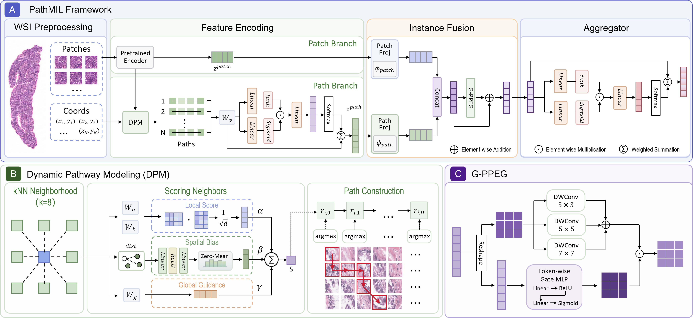

# PathMIL

<p align="center">
  <strong>PathMIL: Path-aware Multiple Instance Learning for Weakly Supervised Whole-Slide Image Classification</strong>
</p>

<p align="center">
  Official implementation of PathMIL, a path-aware dual-stream multiple instance learning framework for weakly supervised whole-slide image classification.
</p>

<p align="center">
  <a href="#overview">Overview</a> •
  <a href="#framework">Framework</a> •
  <a href="#installation">Installation</a> •
  <a href="#data-preparation">Data Preparation</a> •
  <a href="#training">Training</a> •
  <a href="#evaluation">Evaluation</a> •
  <a href="#visualization">Visualization</a> •
  <a href="#citation">Citation</a>
</p>

---

## News

- **Paper link will be updated after publication.**

## Overview

Multiple instance learning enables whole-slide image classification using only slide-level annotations. Most existing MIL methods represent a whole-slide image as an unordered collection of patches and directly aggregate patch-level evidence for slide-level prediction. However, this formulation provides limited modeling of the continuous and directional organization of diagnostically relevant morphology across neighboring tissue regions.

PathMIL introduces an intermediate **path-level representation** between patch encoding and slide aggregation. Its core component, **Dynamic Pathway Modeling (DPM)**, constructs short directed local pathways from individual seed patches. At each step, neighboring candidates are evaluated by combining local feature similarity, spatial bias, and global guidance.

The resulting pathway features are aggregated into path-level embeddings and fused with patch-level representations. A **Gated Multi-scale Positional Encoding module (G-PPEG)** further captures local tissue continuity and hierarchical spatial regularities before slide-level MIL aggregation.

PathMIL therefore models both:

- patch-level morphological appearance;
- path-level directional and spatial organization.

Experiments on four public benchmarks and one internal neuropathology cohort demonstrate consistent improvements across diverse whole-slide image classification tasks.

<p align="center">
  
</p>


## Highlights

- **Path-level Evidence Modeling**  
  Introduces an intermediate representation between patch-level features and slide-level prediction.

- **Dynamic Pathway Modeling**  
  Constructs short directed local pathways by integrating local feature similarity, spatial relationships, and global guidance.

- **Dual-stream Representation Learning**  
  Jointly models patch-level appearance and path-level morphological organization.

- **Gated Multi-scale Positional Encoding**  
  Adaptively captures tissue continuity and hierarchical spatial regularities.

- **Pathway-based Visualization**  
  Complements conventional patch-level attention heatmaps with spatially coherent local trajectories.

## Installation

### 1. Clone the repository

```bash
git clone https://github.com/MrSakasky/PathMIL.git
cd PathMIL
```

### 2. Create the Conda environment

```bash
conda env create -f env.yml
conda activate pathmil
```

The environment uses Python 3.10 and includes PyTorch, timm, OpenSlide, h5py, pandas, scikit-learn, PyYAML, TensorBoard, and the remaining runtime dependencies.

On Windows, if OpenSlide is installed outside the Conda environment and its DLLs cannot be found, set `OPENSLIDE_PATH` before running WSI preprocessing:

```powershell
$env:OPENSLIDE_PATH = "C:\path\to\openslide\bin"
```

## Data Preparation

The complete pipeline is:

```text
WSI files
  └── create_patches.py
        └── coordinate or image HDF5 bags
              └── extract_features.py
                    ├── h5_files/<slide_id>.h5
                    └── pt_files/<slide_id>.pt
                          └── PathMIL training
```

The coordinate pipeline is recommended because it stores patch coordinates instead of materializing every patch image.

### Dataset CSV

The training CSV must contain `case_id`, `slide_id`, and the configured label column:

```csv
case_id,slide_id,label
patient_001,slide_001,normal_tissue
patient_002,slide_002,tumor_tissue
patient_003,slide_003,normal_tissue
```

Important:

- `slide_id` should normally be the filename stem without the WSI extension.
- `case_id` may equal `slide_id` when there is one slide per patient.
- label strings must exactly match the keys in `data.label_dict`.
- multiple slides may share one `case_id`.
- set `data.patient_strat: true` to create patient-stratified splits.

### Option A: coordinate pipeline (recommended)

#### 1. Segment slides and create coordinate bags

```bash
python create_patches.py \
  --source data/slides \
  --save-dir data/patches_camelyon16 \
  --pipeline coordinates \
  --patch-size 256 \
  --step-size 256 \
  --patch-level 0 \
  --stitch
```

This creates:

```text
data/patches_camelyon16/
├── patches/
│   ├── slide_001.h5
│   └── ...
├── masks/
├── stitches/
└── process_list_autogen.csv
```

The coordinate HDF5 bags store `coords` together with the patch level and patch size metadata.

#### 2. Extract patch features

```bash
python extract_features.py \
  --csv-path dataset_csv/train_camelyon16_all.csv \
  --data-h5-dir data/patches_camelyon16 \
  --data-slide-dir data/slides \
  --feature-dir features/camelyon16_resnet50 \
  --pipeline coordinates \
  --slide-ext .svs \
  --model-name resnet50_trunc \
  --batch-size 128
```

The extractor reads each patch directly from its WSI. By default it uses the patch level and patch size stored in the coordinate HDF5 file. They can be overridden when necessary:

```bash
python extract_features.py \
  --csv-path dataset_csv/train_camelyon16_all.csv \
  --data-h5-dir data/patches_camelyon16 \
  --data-slide-dir data/slides \
  --feature-dir features/camelyon16_resnet50 \
  --pipeline coordinates \
  --patch-level 1 \
  --read-patch-size 256
```

### Option B: materialized image-bag pipeline

This pipeline stores patch pixels inside the HDF5 bags, so feature extraction no longer requires access to the original WSI files.

```bash
python create_patches.py \
  --source data/slides \
  --save-dir data/image_bags_camelyon16 \
  --pipeline images \
  --patch-size 256 \
  --step-size 256 \
  --patch-level 0
```

```bash
python extract_features.py \
  --csv-path dataset_csv/train_camelyon16_all.csv \
  --data-h5-dir data/image_bags_camelyon16 \
  --feature-dir features/camelyon16_resnet50 \
  --pipeline images \
  --model-name resnet50_trunc
```

### Extracted feature structure

Feature extraction creates:

```text
features/camelyon16_resnet50/
├── h5_files/
│   ├── slide_001.h5
│   ├── slide_002.h5
│   └── ...
└── pt_files/
    ├── slide_001.pt
    ├── slide_002.pt
    └── ...
```

Each feature HDF5 file contains:

```text
features: [N, C]
coords:   [N, 2]
```

The feature and coordinate order must match. PathMIL training uses the HDF5 files because pathway construction requires both arrays.

### Supported feature encoders

`extract_features.py` currently supports:

| Encoder name | Checkpoint requirement |
|---|---|
| `resnet50_trunc` | Uses timm ImageNet-pretrained weights |
| `uni_v1` | Requires `--encoder-checkpoint` or `UNI_CKPT_PATH` |
| `conch_v1` | Requires the CONCH package and `--encoder-checkpoint` or `CONCH_CKPT_PATH` |

Example:

```bash
python extract_features.py \
  --csv-path dataset_csv/train_camelyon16_all.csv \
  --data-h5-dir data/patches_camelyon16 \
  --data-slide-dir data/slides \
  --feature-dir features/camelyon16_uni \
  --pipeline coordinates \
  --model-name uni_v1 \
  --encoder-checkpoint checkpoints/uni.bin
```

Always set `model.embed_dim` in the training YAML to the dimension produced by the selected encoder. The default truncated ResNet-50 configuration produces 1024-dimensional features.

### Reusable patching presets

Create a segmentation and patching preset:

```bash
python build_preset.py --preset-name camelyon16
```

Use it during patch creation:

```bash
python create_patches.py \
  --source data/slides \
  --save-dir data/patches_camelyon16 \
  --pipeline coordinates \
  --preset presets/camelyon16.csv
```

### Path handling

- Relative `csv_path`, `data_root_dir`, and `results_dir` values are resolved from the project root.
- A relative `feature_dir` is joined to `data_root_dir`.
- An absolute `feature_dir` is used directly.
- When `split_dir` is `null`, it resolves to `splits/<task>_<label_fraction_percent>`.
- With `k_start: -1` and `k_end: -1`, all folds are trained.

For Windows paths, use YAML single quotes and do not use Python's `r"..."` syntax:

```yaml
data:
  feature_dir: 'G:\path\to\features\camelyon16_resnet50'
```

### Validate the effective configuration

Print the fully merged configuration without starting training:

```bash
python main.py --config configs/train_camelyon16.yaml --print-config
```

Configuration precedence is:

```text
code defaults < YAML values < command-line overrides
```

## Cross-Validation Splits

Create stratified cross-validation split files from the training YAML:

```bash
python create_splits.py \
  --config configs/train_camelyon16.yaml \
  --val-frac 0.2 \
  --test-frac 0.1
```

With the example configuration, the files are written to:

```text
splits/task_1_tumor_vs_normal_100/
├── splits_0.csv
├── splits_0_bool.csv
├── splits_0_descriptor.csv
├── ...
└── splits_4_descriptor.csv
```

Each `splits_<fold>.csv` contains `train`, `val`, and `test` columns. When `patient_strat: true`, splitting is performed at the `case_id` level so slides belonging to the same patient stay together.

To use an explicit destination:

```bash
python create_splits.py \
  --config configs/train_camelyon16.yaml \
  --output-dir splits/camelyon16_custom
```

Then set:

```yaml
splits:
  split_dir: splits/camelyon16_custom
```

## Training

### Train all configured folds

```bash
python main.py --config configs/train_camelyon16.yaml
```

If `--config` is omitted, `configs/train_camelyon16.yaml` is used.

### Train one fold

`k_end` is exclusive, so the following command trains fold 0 only:

```bash
python main.py \
  --config configs/train_camelyon16.yaml \
  --k-start 0 \
  --k-end 1
```

### Override common settings

```bash
python main.py \
  --config configs/train_camelyon16.yaml \
  --exp-code pathmil_camelyon16_seed2 \
  --seed 2 \
  --lr 0.0001 \
  --max-epochs 100
```

Other available overrides include:

```text
--data-root-dir
--csv-path
--feature-dir
--results-dir
--split-dir
--projection-reg-weight
--instance-supervision
--no-instance-supervision
```

Run `python main.py --help` for the complete command-line interface.

### Training outputs

For:

```yaml
experiment:
  exp_code: pathmil_camelyon16
  results_dir: results
  seed: 1
```

outputs are written to:

```text
results/pathmil_camelyon16_s1/
├── config_effective.yaml
├── experiment_pathmil_camelyon16.txt
├── s_0_checkpoint.pt
├── split_0_results.pkl
├── splits_0.csv
├── summary.csv
└── tensorboard/
    └── fold_0/
        └── events.out.tfevents.*
```

`summary.csv` reports validation and test AUC and accuracy for every completed fold. A partial fold range produces `summary_partial_<start>_<end>.csv`.

### TensorBoard

TensorBoard logging is enabled with:

```yaml
experiment:
  log_data: true
```

The logs contain training and validation losses, instance loss, projection regularization, accuracy, error, AUC, class-wise accuracy, learning rate, gradient norm, epoch duration, final evaluation metrics, model parameter counts, the runtime device, and the effective YAML configuration.

Start TensorBoard with:

```bash
tensorboard --logdir results/pathmil_camelyon16_s1/tensorboard
```

Then open <http://localhost:6006>.

## Evaluation

Evaluate the test split for every configured fold:

```bash
python eval.py \
  --config configs/train_camelyon16.yaml \
  --checkpoint-dir results/pathmil_camelyon16_s1 \
  --split test
```

The checkpoint directory is inferred from `exp_code`, `results_dir`, and `seed` when `--checkpoint-dir` is omitted:

```bash
python eval.py --config configs/train_camelyon16.yaml --split test
```

Evaluate one fold:

```bash
python eval.py \
  --config configs/train_camelyon16.yaml \
  --split test \
  --fold 0
```

`--fold` may be repeated to evaluate selected folds:

```bash
python eval.py \
  --config configs/train_camelyon16.yaml \
  --fold 0 \
  --fold 2 \
  --fold 4
```

Available split choices are `train`, `validation`, `test`, and `all`.

By default, predictions and summaries are saved under:

```text
eval_results/pathmil_camelyon16_s1/
├── fold_0.csv
├── ...
└── summary.csv
```

Each fold CSV contains slide IDs, labels, and class probabilities; the predicted class is the probability argmax. The summary reports fold-level AUC and accuracy.


## Testing

Run the test suite from the repository root:

```bash
python -m unittest discover -s tests -v
```

The tests cover configuration loading, data contracts, training/evaluation integration, device-safe losses, visited-node masking, straight-through gradients, and pathway boundary handling.

## Datasets

PathMIL was evaluated on four public datasets and one internal neuropathology cohort.

| Dataset | Task | Availability |
|---|---|---|
| CAMELYON16 | Lymph-node metastasis classification | Public |
| TCGA-Lung | LUAD versus LUSC classification | Public |
| TCGA-NSCLC | Pathological T-stage-related classification | Public |
| PANDA | Prostate cancer ISUP grade prediction | Public |
| Brain Bank | Aβ plaque micro-lesion pattern classification | Internal |

Public datasets must be downloaded from their official sources and used under their respective licenses and data-use agreements. The internal Brain Bank cohort cannot be redistributed through this repository because it is subject to institutional ethics and data-governance requirements.

## Citation

Citation information will be added after publication.

## Acknowledgements

We thank the developers of the open-source computational pathology and multiple instance learning projects that support this work, including [CLAM](https://github.com/mahmoodlab/CLAM).

Human brain tissue used in this study was provided by the National Human Brain Bank for Development and Function, Chinese Academy of Medical Sciences and Peking Union Medical College, with support from the relevant brain banking and neuroscience resources.

The use of the internal cohort follows the institutional ethics approvals and data-governance requirements described in the manuscript.


## Contact

For questions, suggestions, or bug reports, please open an issue in this repository.

